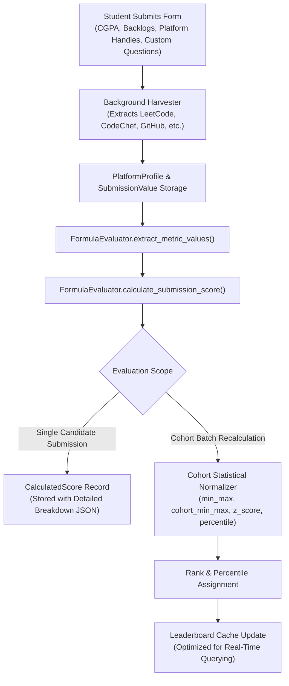

# SSVS Intelligent Formula Scoring Engine

The **Smart Student Verification System (SSVS) Formula Scoring Engine** is an enterprise-grade evaluation pipeline engineered for university placement cells, hackathon organizers, and academic administrators. It objectively aggregates verified competitive programming performance, open-source version control statistics, dynamic form inputs, and academic metrics into a normalized, multi-dimensional candidate evaluation score on any user-defined scale.

---

## 1. System Architecture & Component Mapping

The engine is structured with separation of concerns between data models, statistical normalizers, evaluation pipelines, and user-facing administration studios.

| Component / Layer | Local File Path | Core Responsibilities |
| :--- | :--- | :--- |
| **Scoring Models** | [`app/models/scoring.py`](file:///d:/Agents/SSVS/app/models/scoring.py) | Relational schema for [`ScoreFormula`](file:///d:/Agents/SSVS/app/models/scoring.py#L7), [`FormulaRule`](file:///d:/Agents/SSVS/app/models/scoring.py#L40), [`CalculatedScore`](file:///d:/Agents/SSVS/app/models/scoring.py#L70), and [`LeaderboardEntry`](file:///d:/Agents/SSVS/app/models/scoring.py#L110). |
| **Core Evaluator** | [`app/scoring_engine/formula_evaluator.py`](file:///d:/Agents/SSVS/app/scoring_engine/formula_evaluator.py) | Metric extraction, mathematical rule evaluation, bonus awards, penalty deduction, and cohort ranking. |
| **Statistical Normalizer** | [`app/scoring_engine/normalizer.py`](file:///d:/Agents/SSVS/app/scoring_engine/normalizer.py) | Mathematical implementations for Min-Max, Gaussian Z-Score, and Percentile calculations. |
| **Domain Presets** | [`app/scoring_engine/default_presets.py`](file:///d:/Agents/SSVS/app/scoring_engine/default_presets.py) | Production-ready formula templates for placement drives, competitive programming, and AI/Data Science. |
| **Formula Builder Controller** | [`app/forms_mgr/routes.py`](file:///d:/Agents/SSVS/app/forms_mgr/routes.py#L673) | Route handlers for formula customization ([`formula_builder`](file:///d:/Agents/SSVS/app/forms_mgr/routes.py#L675)) and preset applications ([`apply_preset`](file:///d:/Agents/SSVS/app/forms_mgr/routes.py#L742)). |
| **Visual Formula Studio** | [`app/templates/scoring/formula_builder.html`](file:///d:/Agents/SSVS/app/templates/scoring/formula_builder.html) | Interactive web UI with real-time balance tallies, benchmark inputs, and custom metric creators. |
| **Asynchronous Worker** | [`app/utils/background.py`](file:///d:/Agents/SSVS/app/utils/background.py) | Background trigger evaluating formulas upon asynchronous platform scraping completion. |

---

## 2. End-to-End Evaluation Pipeline

---

## 3. Mathematical Formulation & Computation Rules

### 3.1. Metric Value Extraction & Normalization
Raw metrics are extracted into a sanitized dictionary via [`FormulaEvaluator.extract_metric_values`](file:///d:/Agents/SSVS/app/scoring_engine/formula_evaluator.py#L25). All values undergo defensive parsing via `safe_float`:
- Academic CGPA is bounded: $\text{cgpa} \in [0.0, 10.0]$
- Active backlogs cannot be negative: $\text{backlogs} \ge 0$ (prevents negative penalty exploits)
- All platform metrics and custom form fields default defensively to `0.0` if unprovided or invalid.

### 3.2. Earned Marks Calculation
For each positive metric rule:
$$\text{multiplier} = \begin{cases} \text{rule.multiplier} & \text{if explicit multiplier provided} \\ \frac{\text{rule.max\_marks}}{\text{rule.benchmark}} & \text{if benchmark target provided} \\ 1.0 & \text{otherwise} \end{cases}$$

$$\text{rule\_earned} = \max\Big(0.0, \min\big(\text{rule.max\_marks}, \text{raw\_value} \times \text{multiplier}\big)\Big)$$

### 3.3. Excellence Bonuses
If a candidate exceeds an elite benchmark threshold ($\text{bonus\_threshold} > 0$ and $\text{raw\_value} \ge \text{bonus\_threshold}$):
$$\text{rule\_bonus} = \text{rule.bonus\_marks}$$
*Note: Bonuses are tracked in a dedicated `bonus_awarded` column and are added once to candidate subtotals, ensuring zero double-counting.*

### 3.4. Penalties & Backlog Deductions
For penalty rules (e.g. active academic backlogs or infractions):
$$\text{deduction} = \max(0.0, \text{raw\_value}) \times \max(0.0, \text{rule.penalty\_per\_unit})$$

### 3.5. Subtotal & Moderation Adjustments
$$\text{subtotal} = \text{academic\_score} + \text{coding\_score} + \text{github\_score} + \text{bonus\_awarded} - \text{penalty\_deductions} + \text{manual\_adjustment}$$
$$\text{total\_score} = \max\Big(0.0, \min\big(\text{formula.max\_total\_marks}, \text{subtotal}\big)\Big)$$

### 3.6. Scale-Independent Letter Grading
Grade boundaries scale proportionally with `max_total_marks`:
$$\text{percentage} = \frac{\text{total\_score}}{\text{formula.max\_total\_marks}} \times 100$$

$$\text{Grade} = \begin{cases} 
\text{A+} & \text{if } \text{percentage} \ge 85\% \\
\text{A} & \text{if } \text{percentage} \ge 70\% \\
\text{B} & \text{if } \text{percentage} \ge 55\% \\
\text{C} & \text{if } \text{percentage} \ge 40\% \\
\text{D} & \text{otherwise}
\end{cases}$$

---

## 4. Cohort Normalization Modes

The engine supports 5 distinct normalization strategies via [`ScoreFormula.normalization_method`](file:///d:/Agents/SSVS/app/models/scoring.py#L14):

1. **`min_max` (Rule Clamped, Default)**:
   Each metric is normalized directly to its rule-level `max_marks` ceiling. Ideal for fixed benchmark evaluation where scores reflect absolute achievement.
2. **`cohort_min_max` (Cohort Dynamic Min-Max)**:
   Scales scores relative to the cohort's dynamic spread:
   $$\text{score}_{\text{norm}} = \frac{\text{raw} - \text{raw}_{\min}}{\text{raw}_{\max} - \text{raw}_{\min}} \times \text{max\_total\_marks}$$
3. **`z_score` (Gaussian Bell Curve Standardization)**:
   Standardizes scores using cohort mean ($\mu$) and standard deviation ($\sigma$):
   $$z = \frac{\text{raw} - \mu}{\sigma}, \quad \text{mapped} = \frac{z + 3}{6} \times \text{max\_total\_marks}$$
4. **`percentile` (Percentile Scaled)**:
   Sets candidate score according to their percentile rank in the cohort:
   $$\text{score}_{\text{norm}} = \frac{\text{percentile}}{100} \times \text{max\_total\_marks}$$
5. **`weighted_sum` (Direct Linear Sum)**:
   Direct unscaled summation bounded strictly to $[0, \text{max\_total\_marks}]$.

---

## 5. Comprehensive Metric Catalog

| Metric Key | Platform / Domain | Standard Benchmark Target | Typical Category | Description |
| :--- | :--- | :--- | :--- | :--- |
| `cgpa` | Academic Records | 10.0 CGPA | `academic` | Degree Cumulative Grade Point Average. |
| `backlogs_penalty` | Academic Records | 0 backlogs | `penalty` | Active un-cleared backlogs deduction. |
| `leetcode_solved` | LeetCode | 300 problems | `coding` | Total accepted LeetCode algorithmic problems. |
| `leetcode_rating` | LeetCode | 1800 rating | `coding` | Contest Elo rating on LeetCode. |
| `leetcode_hard` | LeetCode | 50 problems | `coding` | Hard-tier LeetCode algorithmic solutions. |
| `codechef_rating` | CodeChef | 1700 rating | `coding` | Star rating division Elo on CodeChef. |
| `codechef_stars` | CodeChef | 5 stars | `coding` | CodeChef star rating (1 to 7). |
| `codeforces_rating`| Codeforces | 1600 rating | `coding` | Codeforces competitive contest rating. |
| `github_stars_repos`| GitHub | 20.0 index | `github` | Composite score: `0.8 * repos + 1.5 * stars`. |
| `github_repos` | GitHub | 20 repos | `github` | Count of public GitHub repositories. |
| `github_stars` | GitHub | 10 stars | `github` | Total stargazers earned across repos. |
| `github_contributions`| GitHub | 365 commits | `github` | Past-year public commit contributions. |
| `hackerrank_badges`| HackerRank | 8 badges | `coding` | Verified skill badges on HackerRank. |
| `gfg_problems` | GeeksforGeeks | 250 problems | `coding` | Coding problems solved on GeeksforGeeks. |
| `gfg_score` | GeeksforGeeks | 1500 score | `coding` | Coding score on GeeksforGeeks. |
| `atcoder_rating` | AtCoder | 1200 rating | `coding` | AtCoder contest rating. |
| `atcoder_highest` | AtCoder | 1400 rating | `coding` | Historical highest contest rating. |
| `interviewbit_score`| InterviewBit | 3000 score | `coding` | Practice score on InterviewBit. |
| `kaggle_medals` | Kaggle | 5 medals | `coding` | Competition/Dataset medals earned on Kaggle. |
| `kaggle_score` | Kaggle | 100 score | `coding` | Activity index across Kaggle notebooks & comps. |
| `<custom_field_key>`| Dynamic Form | Variable | `custom` | Any numeric input captured by the custom form builder. |

---

## 6. Built-In Domain Presets

The scoring engine provides 4 built-in presets located in [`app/scoring_engine/default_presets.py`](file:///d:/Agents/SSVS/app/scoring_engine/default_presets.py):

1. **Standard Placement Drive (`standard_placement`)**:
   - Balanced weightage across CGPA (25%), LeetCode (25% + 15%), CodeChef (15%), GitHub (10%), HackerRank (10%), with active backlog penalty (-5 marks/backlog).
2. **Competitive Programming Specialist (`competitive_programming`)**:
   - Heavy weighting on contest ratings across LeetCode (30% + 25%), Codeforces (25%), and CodeChef (20%).
3. **Data Science & AI Specialist (`data_science_ai`)**:
   - Focuses on Kaggle performance (30%), GitHub repositories & stars (25%), CGPA (25%), and LeetCode problem solving (20%).
4. **All-Rounder Competitive Master (`all_platforms_pro`)**:
   - Spans LeetCode, Codeforces, AtCoder, InterviewBit, GitHub, and Academics.

---

## 7. How Teachers Customize Scoring Formulas

1. Open the form in **Forms Manager** and navigate to **Formula Builder** (`/forms/<form_id>/formula`).
2. Select an existing domain preset from the **Apply Domain Preset** dropdown to prefill standard rules, OR customize rules manually.
3. Configure the **Maximum Score Scale** (e.g. `100.0`, `50.0`, or `500.0`).
4. Select the desired **Cohort Normalization** strategy (`min_max`, `cohort_min_max`, `z_score`, `percentile`, or `weighted_sum`).
5. For each rule:
   - Select the **Metric Source** (standard platforms or dynamic custom fields).
   - Enter a **Benchmark Target** (the value that yields 100% of allocated marks).
   - Assign **Weight (%)** and **Max Marks**.
   - Optionally configure **Bonus Threshold** and **Bonus Marks** for elite performance.
   - For penalties, assign **Penalty / Unit**.
6. The **Formula Balance Tally** card provides real-time verification of total marks and percentage weights.
7. Click **Save Formula & Recalculate Ranks** to re-score all cohort submissions instantly.

---

## 8. Defensive Engineering & Performance Optimizations

1. **Zero N+1 Database Queries**:
   [`FormulaEvaluator.update_form_ranks_and_leaderboard`](file:///d:/Agents/SSVS/app/scoring_engine/formula_evaluator.py#L236) batch-fetches all `PlatformProfile` and `SubmissionValue` records in two queries before iterating over candidates.
2. **Cache Synchronization**:
   Bulk deletions utilize `synchronize_session='fetch'` and explicit commits to prevent SQLAlchemy identity map collisions (`SAWarning`).
3. **Anti-Cheating Guards**:
   Active backlogs and penalty inputs are clamped with `max(0.0, val)`, preventing negative integer submissions from adding fraudulent marks.
4. **Defensive Value Casting**:
   All metric fields utilize `safe_float()`, protecting against `NaN`, `Inf`, empty strings, and type mismatches.
